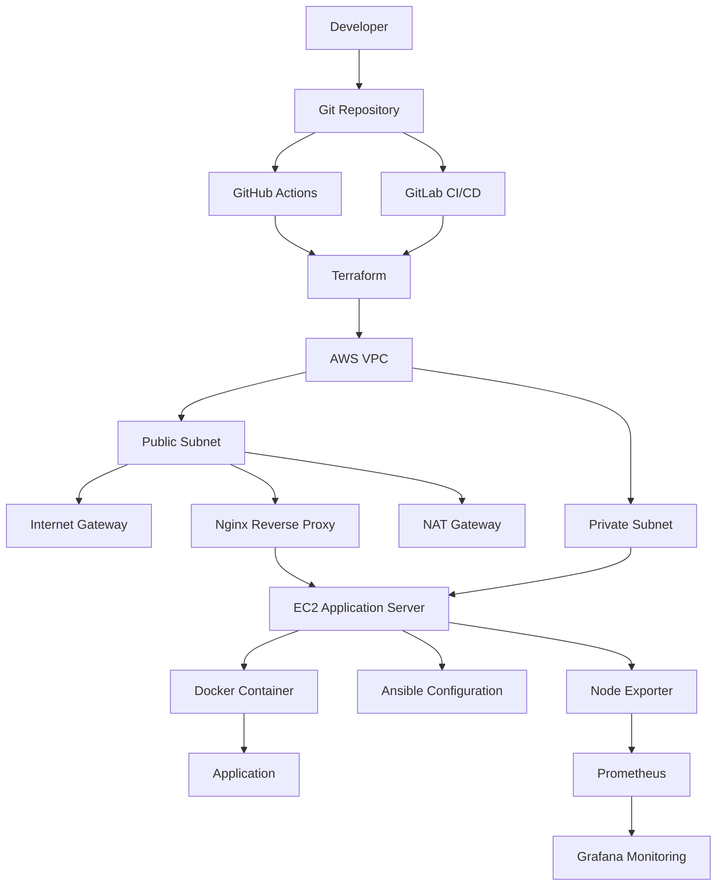
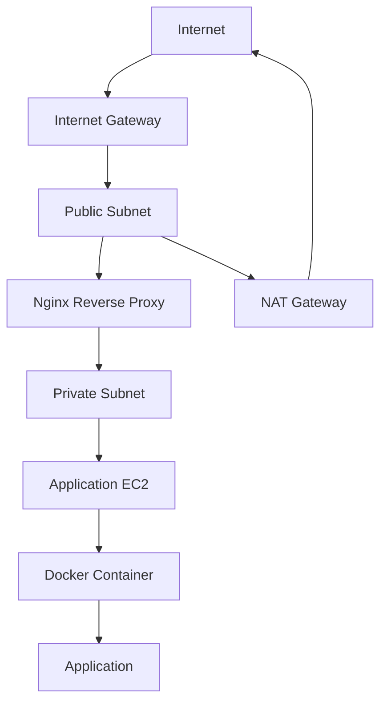
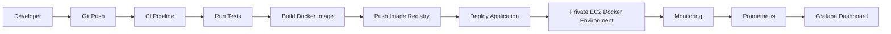

# Production Cloud Infrastructure Automation Platform

## Overview

This project demonstrates a production-like cloud infrastructure platform built on AWS.

The goal is to automate infrastructure provisioning, Linux server configuration, application deployment, monitoring, and operational workflows using modern DevOps practices.

The project simulates a real-world infrastructure environment where cloud resources, automation tools, containerized applications, and monitoring systems work together.

---

# Architecture

## High-Level Architecture



---

# Infrastructure Design

The platform includes:

- AWS VPC networking
- Public and private subnet architecture
- Internet Gateway
- NAT Gateway for private subnet outbound access
- EC2 Linux servers
- Security Groups
- IAM permissions
- Nginx reverse proxy
- Docker containerized applications
- Ansible configuration management
- Prometheus and Grafana monitoring
- GitHub Actions and GitLab CI/CD pipelines

---

# Network Architecture

The platform uses a production-like AWS VPC network design.



## Public Subnet

Contains internet-facing resources:

- Internet Gateway
- Nginx Reverse Proxy
- NAT Gateway

Public subnet resources handle external communication.

---

## Private Subnet

Contains internal workloads:

- EC2 application servers
- Docker containers
- Monitoring components

Private resources do not receive direct inbound internet access.

Outbound internet access is provided through NAT Gateway.

---

# CI/CD Workflow



---

# Technology Stack

## Cloud

- AWS
  - VPC
  - Public Subnets
  - Private Subnets
  - Internet Gateway
  - NAT Gateway
  - EC2
  - Security Groups
  - IAM
  - S3

## Infrastructure as Code

- Terraform

## Configuration Management

- Ansible

## Operating System

- Linux
  - Ubuntu
  - RHEL/CentOS concepts

## Containerization

- Docker
- Docker Compose

## Web Infrastructure

- Nginx
- Reverse Proxy
- Load Balancing Concepts

## Monitoring & Observability

- Prometheus
- Grafana
- Node Exporter
- AWS CloudWatch

## CI/CD

- GitHub Actions
- GitLab CI/CD

---

# Project Structure

```
production-cloud-infrastructure-platform

├── terraform
│   ├── environments
│   │   └── dev
│   └── modules
│
├── ansible
│   ├── inventory
│   ├── playbooks
│   └── roles
│
├── application
│   └── dockerized application
│
├── monitoring
│   ├── prometheus
│   └── grafana
│
├── cicd
│   ├── github-actions
│   └── gitlab-ci
│
├── diagrams
│
└── README.md

```

---

# Deployment Roadmap

## Phase 1 - Infrastructure Provisioning

- [ ] Create AWS VPC networking
- [ ] Create public and private subnets
- [ ] Configure Internet Gateway
- [ ] Configure NAT Gateway
- [ ] Provision EC2 Linux servers using Terraform
- [ ] Configure Security Groups and IAM permissions

## Phase 2 - Configuration Automation

- [ ] Configure Linux servers using Ansible
- [ ] Automate Docker installation
- [ ] Automate Nginx installation and configuration

## Phase 3 - Application Deployment

- [ ] Build Docker application image
- [ ] Deploy application containers
- [ ] Configure Nginx reverse proxy

## Phase 4 - Monitoring

- [ ] Install Node Exporter
- [ ] Configure Prometheus
- [ ] Build Grafana dashboards
- [ ] Monitor system performance

## Phase 5 - CI/CD Automation

- [ ] Implement GitHub Actions pipeline
- [ ] Implement GitLab CI/CD pipeline
- [ ] Automate application deployment

---

# Skills Demonstrated

This project demonstrates hands-on experience with:

- Linux system administration
- Cloud infrastructure design
- Infrastructure as Code (IaC)
- Configuration management
- Containerization
- CI/CD automation
- Monitoring and troubleshooting
- DevOps operational practices

---

# Future Improvements

- Add AWS Application Load Balancer
- Implement Auto Scaling Groups
- Add HTTPS/TLS certificate management
- Implement centralized logging
- Improve disaster recovery strategy
- Migrate workload to Kubernetes
- Add GitOps deployment with Argo CD